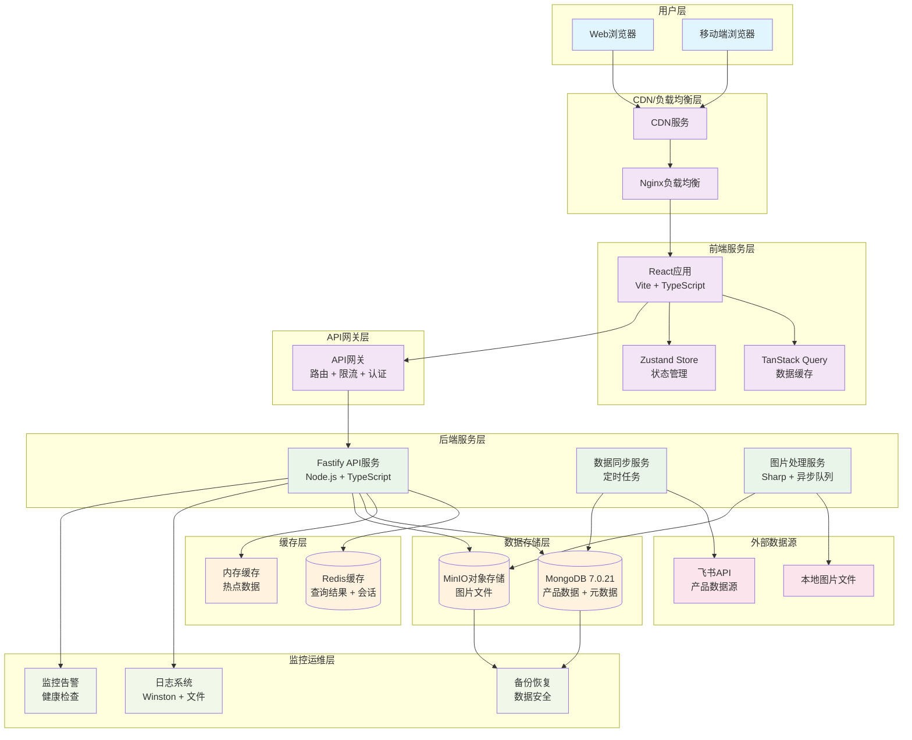
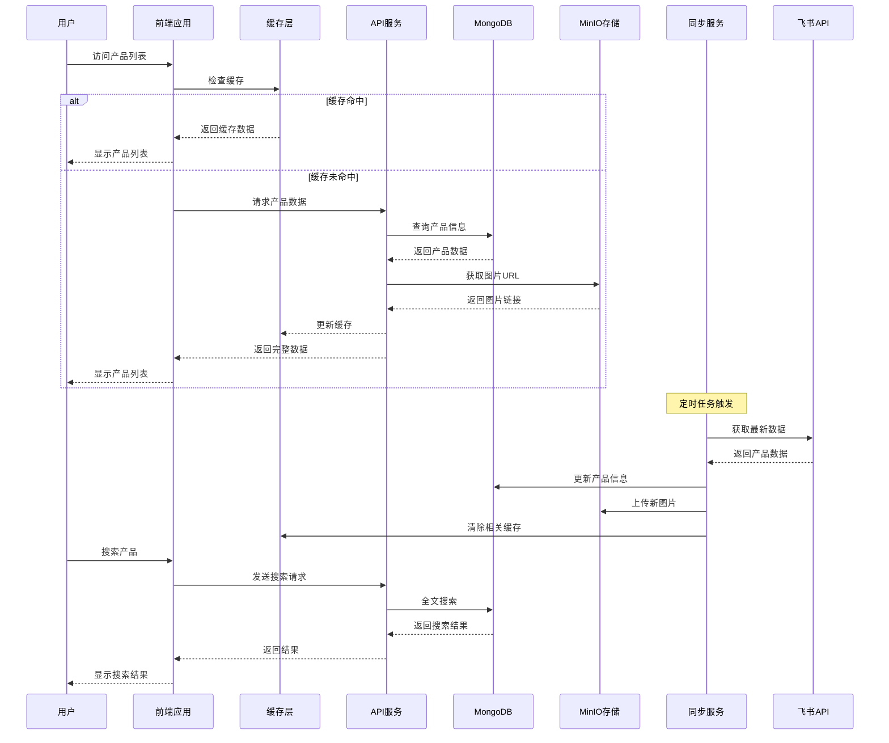
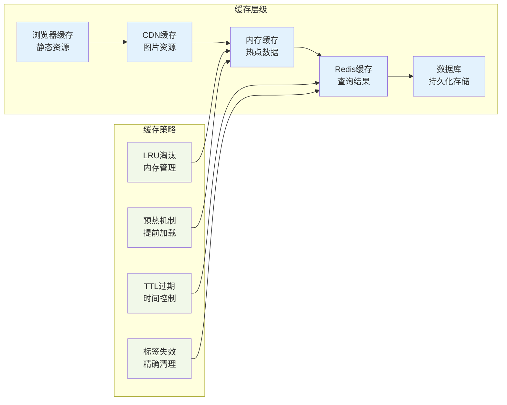
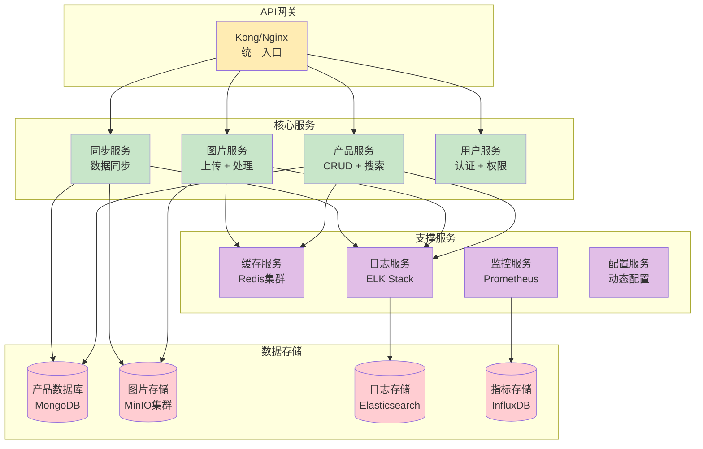
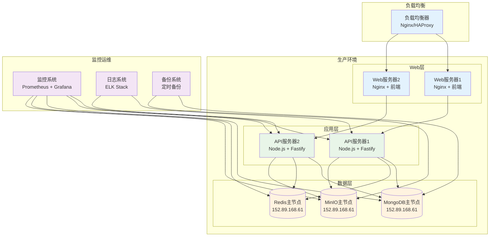

# 产品展示系统架构图

## 整体系统架构

```mermaid
graph TB
    subgraph "用户层"
        U1[Web浏览器]
        U2[移动端浏览器]
    end
    
    subgraph "CDN/负载均衡层"
        CDN[CDN服务]
        LB[Nginx负载均衡]
    end
    
    subgraph "前端服务层"
        FE[React应用<br/>Vite + TypeScript]
        FE --> TQ[TanStack Query<br/>数据缓存]
        FE --> ZS[Zustand Store<br/>状态管理]
    end
    
    subgraph "API网关层"
        GW[API网关<br/>路由 + 限流 + 认证]
    end
    
    subgraph "后端服务层"
        API[Fastify API服务<br/>Node.js + TypeScript]
        SYNC[数据同步服务<br/>定时任务]
        IMG[图片处理服务<br/>Sharp + 异步队列]
    end
    
    subgraph "缓存层"
        REDIS[(Redis缓存<br/>查询结果 + 会话)]
        MEM[内存缓存<br/>热点数据]
    end
    
    subgraph "数据存储层"
        MONGO[(MongoDB 7.0.21<br/>产品数据 + 元数据)]
        MINIO[(MinIO对象存储<br/>图片文件)]
    end
    
    subgraph "外部数据源"
        FEISHU[飞书API<br/>产品数据源]
        FILES[本地图片文件]
    end
    
    subgraph "监控运维层"
        LOG[日志系统<br/>Winston + 文件]
        MONITOR[监控告警<br/>健康检查]
        BACKUP[备份恢复<br/>数据安全]
    end
    
    %% 用户访问流程
    U1 --> CDN
    U2 --> CDN
    CDN --> LB
    LB --> FE
    
    %% 前端到后端
    FE --> GW
    GW --> API
    
    %% 后端服务交互
    API --> REDIS
    API --> MEM
    API --> MONGO
    API --> MINIO
    
    %% 数据同步流程
    SYNC --> FEISHU
    SYNC --> MONGO
    IMG --> FILES
    IMG --> MINIO
    
    %% 监控流程
    API --> LOG
    API --> MONITOR
    MONGO --> BACKUP
    MINIO --> BACKUP
    
    %% 样式定义
    classDef userLayer fill:#e1f5fe
    classDef frontendLayer fill:#f3e5f5
    classDef backendLayer fill:#e8f5e8
    classDef dataLayer fill:#fff3e0
    classDef externalLayer fill:#fce4ec
    classDef monitorLayer fill:#f1f8e9
    
    class U1,U2 userLayer
    class CDN,LB,FE,TQ,ZS,GW frontendLayer
    class API,SYNC,IMG backendLayer
    class REDIS,MEM,MONGO,MINIO dataLayer
    class FEISHU,FILES externalLayer
    class LOG,MONITOR,BACKUP monitorLayer
```

## 数据流架构

```mermaid
sequenceDiagram
    participant User as 用户
    participant FE as 前端应用
    participant Cache as 缓存层
    participant API as API服务
    participant DB as MongoDB
    participant MinIO as MinIO存储
    participant Sync as 同步服务
    participant Feishu as 飞书API
    
    %% 用户访问产品列表
    User->>FE: 访问产品列表
    FE->>Cache: 检查缓存
    
    alt 缓存命中
        Cache-->>FE: 返回缓存数据
        FE-->>User: 显示产品列表
    else 缓存未命中
        FE->>API: 请求产品数据
        API->>DB: 查询产品信息
        DB-->>API: 返回产品数据
        API->>MinIO: 获取图片URL
        MinIO-->>API: 返回图片链接
        API-->>Cache: 更新缓存
        API-->>FE: 返回完整数据
        FE-->>User: 显示产品列表
    end
    
    %% 数据同步流程
    Note over Sync: 定时任务触发
    Sync->>Feishu: 获取最新数据
    Feishu-->>Sync: 返回产品数据
    Sync->>DB: 更新产品信息
    Sync->>MinIO: 上传新图片
    Sync->>Cache: 清除相关缓存
    
    %% 用户搜索
    User->>FE: 搜索产品
    FE->>API: 发送搜索请求
    API->>DB: 全文搜索
    DB-->>API: 返回搜索结果
    API-->>FE: 返回结果
    FE-->>User: 显示搜索结果
```

## 缓存架构设计

```mermaid
graph LR
    subgraph "缓存层级"
        L1[浏览器缓存<br/>静态资源]
        L2[CDN缓存<br/>图片资源]
        L3[内存缓存<br/>热点数据]
        L4[Redis缓存<br/>查询结果]
        L5[数据库<br/>持久化存储]
    end
    
    subgraph "缓存策略"
        S1[LRU淘汰<br/>内存管理]
        S2[TTL过期<br/>时间控制]
        S3[标签失效<br/>精确清理]
        S4[预热机制<br/>提前加载]
    end
    
    L1 --> L2
    L2 --> L3
    L3 --> L4
    L4 --> L5
    
    S1 --> L3
    S2 --> L4
    S3 --> L4
    S4 --> L3
    
    classDef cacheLevel fill:#e3f2fd
    classDef strategy fill:#f1f8e9
    
    class L1,L2,L3,L4,L5 cacheLevel
    class S1,S2,S3,S4 strategy
```

## 微服务拆分规划

```mermaid
graph TB
    subgraph "API网关"
        Gateway[Kong/Nginx<br/>统一入口]
    end
    
    subgraph "核心服务"
        ProductSvc[产品服务<br/>CRUD + 搜索]
        ImageSvc[图片服务<br/>上传 + 处理]
        SyncSvc[同步服务<br/>数据同步]
        UserSvc[用户服务<br/>认证 + 权限]
    end
    
    subgraph "支撑服务"
        CacheSvc[缓存服务<br/>Redis集群]
        LogSvc[日志服务<br/>ELK Stack]
        MonitorSvc[监控服务<br/>Prometheus]
        ConfigSvc[配置服务<br/>动态配置]
    end
    
    subgraph "数据存储"
        ProductDB[(产品数据库<br/>MongoDB)]
        ImageStore[(图片存储<br/>MinIO集群)]
        LogStore[(日志存储<br/>Elasticsearch)]
        MetricStore[(指标存储<br/>InfluxDB)]
    end
    
    Gateway --> ProductSvc
    Gateway --> ImageSvc
    Gateway --> SyncSvc
    Gateway --> UserSvc
    
    ProductSvc --> ProductDB
    ProductSvc --> CacheSvc
    
    ImageSvc --> ImageStore
    ImageSvc --> CacheSvc
    
    SyncSvc --> ProductDB
    SyncSvc --> ImageStore
    
    ProductSvc --> LogSvc
    ImageSvc --> LogSvc
    SyncSvc --> LogSvc
    
    LogSvc --> LogStore
    MonitorSvc --> MetricStore
    
    classDef gateway fill:#ffecb3
    classDef core fill:#c8e6c9
    classDef support fill:#e1bee7
    classDef storage fill:#ffcdd2
    
    class Gateway gateway
    class ProductSvc,ImageSvc,SyncSvc,UserSvc core
    class CacheSvc,LogSvc,MonitorSvc,ConfigSvc support
    class ProductDB,ImageStore,LogStore,MetricStore storage
```

## 部署架构图

```mermaid
graph TB
    subgraph "生产环境"
        subgraph "Web层"
            Web1[Web服务器1<br/>Nginx + 前端]
            Web2[Web服务器2<br/>Nginx + 前端]
        end
        
        subgraph "应用层"
            App1[API服务器1<br/>Node.js + Fastify]
            App2[API服务器2<br/>Node.js + Fastify]
        end
        
        subgraph "数据层"
            DB1[(MongoDB主节点<br/>152.89.168.61)]
            Cache1[(Redis主节点<br/>152.89.168.61)]
            Storage1[(MinIO主节点<br/>152.89.168.61)]
        end
    end
    
    subgraph "负载均衡"
        LB[负载均衡器<br/>Nginx/HAProxy]
    end
    
    subgraph "监控运维"
        Monitor[监控系统<br/>Prometheus + Grafana]
        Log[日志系统<br/>ELK Stack]
        Backup[备份系统<br/>定时备份]
    end
    
    LB --> Web1
    LB --> Web2
    
    Web1 --> App1
    Web2 --> App2
    
    App1 --> DB1
    App1 --> Cache1
    App1 --> Storage1
    
    App2 --> DB1
    App2 --> Cache1
    App2 --> Storage1
    
    Monitor --> App1
    Monitor --> App2
    Monitor --> DB1
    Monitor --> Cache1
    Monitor --> Storage1
    
    Log --> App1
    Log --> App2
    
    Backup --> DB1
    Backup --> Storage1
    
    classDef web fill:#e3f2fd
    classDef app fill:#e8f5e8
    classDef data fill:#fff3e0
    classDef infra fill:#f3e5f5
    
    class Web1,Web2,LB web
    class App1,App2 app
    class DB1,Cache1,Storage1 data
    class Monitor,Log,Backup infra
```
